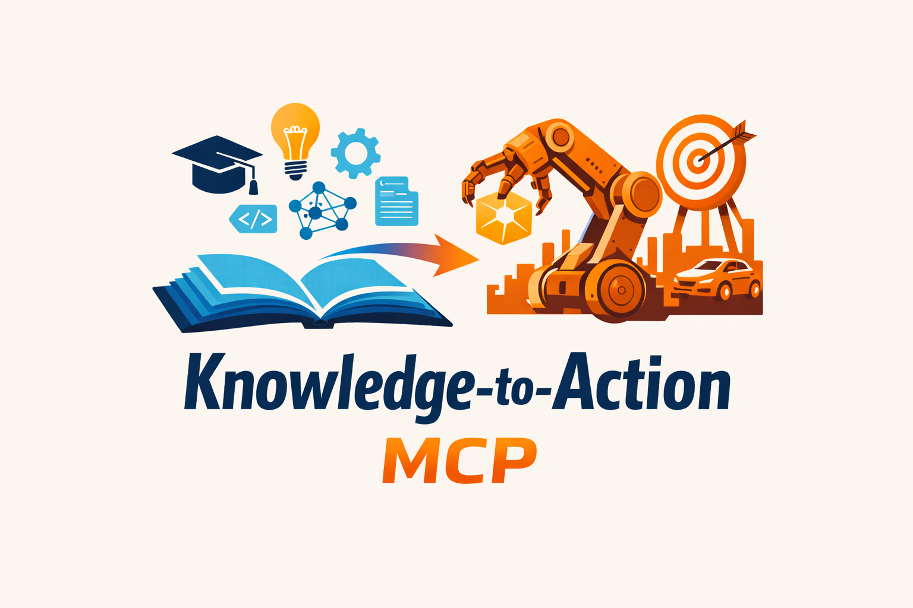

# Knowledge-to-Action MCP

> Turn Obsidian knowledge into agent-ready action plans.



`knowledge-to-action-mcp` is an MCP server for people whose real context lives in notes, not just code.

It starts with Obsidian-aware graph retrieval, adds optional embedding-based GraphRAG, then goes one step further: it turns notes into structured agent context, preview-only action plans, and bounded repo handoffs.

## Why This Exists

Most note integrations stop at:

- read a file
- search a vault
- maybe follow links

That is useful, but incomplete.

If you are actually using an agent, the real workflow is:

1. find the right note
2. recover nearby context
3. understand what matters
4. turn it into a concrete plan
5. connect it to the repo without opening a dangerous shell

That is what this package does.

## What Makes It Different

| Capability | Typical vault MCP | `knowledge-to-action-mcp` |
| --- | --- | --- |
| Read notes | Yes | Yes |
| Search notes | Yes | Yes |
| Follow links / backlinks | Sometimes | Yes |
| Graph-aware context recovery | Rarely | Yes |
| Optional embeddings | Rarely | Yes |
| Agent-ready context packet | No | Yes |
| Preview-only plan from note | No | Yes |
| Note-to-repo handoff | No | Yes |
| General shell access | Sometimes | No |

## 30-Second Demo

Install:

```bash
npm install @tac0de/knowledge-to-action-mcp
```

Run in graph-only mode:

```bash
OBSIDIAN_VAULT_ROOT="/path/to/vault" \
npx @tac0de/knowledge-to-action-mcp
```

Turn on optional embeddings and model planning:

```bash
OBSIDIAN_VAULT_ROOT="/path/to/vault" \
EMBEDDINGS_ENABLED=true \
PLANNING_ENABLED=true \
OPENAI_API_KEY="..." \
npx @tac0de/knowledge-to-action-mcp
```

Then use these tools:

- `context.retrieve`
- `context.bundle_for_agent`
- `action.plan_from_note`
- `action.handoff_to_repo`

## The Core Idea

This project is built around a simple chain:

```text
notes -> retrieval -> context packet -> action plan -> repo handoff
```

That means your MCP client can move from:

```text
"open this markdown file"
```

to:

```text
"understand the note, pull nearby context, summarize risks, suggest next actions,
and show which repo files are probably relevant"
```

## What You Get

### 1. Obsidian-aware retrieval

- deterministic note listing, reading, and search
- wikilink resolution
- backlinks
- shared-tag neighbors
- graph-aware context gathering

### 2. Optional GraphRAG

- markdown chunking
- local SQLite index
- optional embeddings
- hybrid retrieval: lexical + graph + semantic rerank

No `Neo4j` required.

### 3. Agent-ready context packets

Instead of dumping raw notes into a prompt, `context.bundle_for_agent` returns a structured packet:

- brief
- key facts
- open questions
- risks
- related notes
- repo hints

This is much closer to what an agent actually needs.

### 4. Preview-only action planning

`action.plan_from_note` turns a note into:

- summary
- goals
- constraints
- decisions
- open questions
- suggested actions
- handoff prompt

It does **not** mutate files.

### 5. Safe repo handoff

`action.handoff_to_repo` connects note context to a workspace by using:

- bounded ripgrep queries
- bounded git status
- matched file suggestions

This is intentionally not a shell runner.

## Example: Why This Is Useful

Imagine you have these notes:

- `roadmap/search.md`
- `meetings/2026-03-07-search-review.md`
- `decisions/search-scope.md`

And a repo with:

- `src/search.ts`
- `src/features/search/index.ts`

A normal note MCP can help an agent read `roadmap/search.md`.

This MCP can do more:

1. `context.retrieve("search ranking", path="roadmap/search.md")`
   It finds nearby notes using search, backlinks, tags, graph neighbors, and optional embeddings.
2. `context.bundle_for_agent(path="roadmap/search.md")`
   It compresses the useful context into a packet with risks and open questions.
3. `action.plan_from_note(path="roadmap/search.md")`
   It turns the note into a concrete preview-only plan.
4. `action.handoff_to_repo(path="roadmap/search.md")`
   It shows which files in the repo are probably relevant before the agent edits anything.

That jump from "read notes" to "prepare action safely" is the whole point.

## Public Tools

### Vault + Graph

- `vault.list_notes`
- `vault.read_note`
- `vault.search_notes`
- `vault.get_metadata`
- `graph.build`
- `graph.get_neighbors`
- `graph.get_backlinks`
- `context.gather`

### Retrieval + Planning

- `embeddings.index_vault`
- `context.retrieve`
- `context.bundle_for_agent`
- `action.plan_from_note`
- `action.handoff_to_repo`

### Workspace Inspection

- `exec.list_capabilities`
- `exec.rg_search`
- `exec.list_dir`
- `exec.git_status`

## Example Output

`context.bundle_for_agent`:

```json
{
  "brief": "Implement search using the existing dashboard flow.",
  "source": "roadmap/search.md",
  "keyFacts": [
    "Title: Search",
    "Tags: roadmap,search"
  ],
  "openQuestions": [
    "Where is the current search entrypoint?"
  ],
  "risks": [
    "Assumption: repo layout may differ from note context"
  ],
  "repoHints": {
    "matchedFiles": [
      "src/search.ts",
      "src/features/search/index.ts"
    ],
    "suggestedQueries": [
      "Search",
      "search"
    ]
  }
}
```

`action.plan_from_note`:

```json
{
  "source": "roadmap/search.md",
  "summary": "Implement search using the existing dashboard flow.",
  "goals": [
    "Ship dashboard search"
  ],
  "constraints": [
    "No mutation without explicit approval"
  ],
  "openQuestions": [
    "Where is the current search entrypoint?"
  ],
  "suggestedActions": [
    "Review matched repo files",
    "Resolve open questions before implementation"
  ],
  "generationMode": "deterministic"
}
```

## Configuration

### Required

- `OBSIDIAN_VAULT_ROOT`

### Optional embeddings

- `EMBEDDINGS_ENABLED=false`
- `EMBEDDING_PROVIDER=openai`
- `EMBEDDING_MODEL=text-embedding-3-small`
- `EMBEDDING_SQLITE_PATH=.knowledge-to-action-mcp/index.sqlite`
- `OPENAI_API_KEY=...`

### Optional planning

- `PLANNING_ENABLED=false`
- `PLANNING_PROVIDER=openai`
- `PLANNING_MODEL=gpt-4.1-mini`

### Optional workspace inspection

- `EXECUTION_ENABLED=false`
- `EXECUTION_CAPABILITIES=workspace.search,workspace.inspect,workspace.git_status`
- `EXECUTION_TIMEOUT_MS=5000`
- `EXECUTION_MAX_OUTPUT_BYTES=32768`

## Security Boundary

This package is designed to be useful without turning into a local shell bomb.

- vault access is read-only
- plan generation is preview-only
- embeddings are optional and local
- repo inspection is bounded to the configured working directory
- no generic `bash.exec` or arbitrary command tool is exposed

## Good Fit

Use this project if you want:

- Obsidian-native GraphRAG
- note-to-action workflows for agents
- structured context instead of giant markdown dumps
- repo-aware handoff without broad execution access

## Not Trying To Be

- a general purpose agent runtime
- a write-enabled automation framework
- a hosted knowledge platform
- a vector DB product

## Install In MCP Clients

Example stdio command:

```json
{
  "command": "npx",
  "args": ["-y", "@tac0de/knowledge-to-action-mcp"],
  "env": {
    "OBSIDIAN_VAULT_ROOT": "/path/to/vault"
  }
}
```

## Compatibility

- package name: `@tac0de/knowledge-to-action-mcp`
- legacy CLI alias: `obsidian-mcp`
- Node.js 20+

## Status

`v2.1` is real and tested:

- typecheck passes
- unit/integration tests pass
- npm pack dry-run passes

The project is still early, but the core workflow is already usable.

## License

MIT
